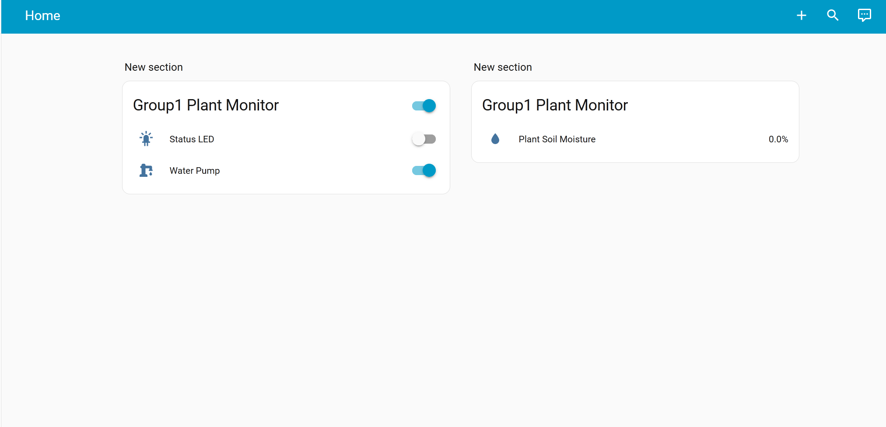

# ESP32 Plant Monitor (Plant Care Device)

> English README — also available in Chinese: `README.zh.md`

---

## What this project is

This is a small plant care device based on an ESP32. It measures soil moisture using an analog soil sensor and can drive a water pump (via a relay or MOSFET) to water the plant. The device integrates with Home Assistant (via MQTT) and exposes:

- A soil moisture sensor (0–100 %)
- A pump switch (manual/remote control)
- A status LED switch



---

## Hardware connections (example)

- ESP32 GPIO34 (ADC1_CH6) -> Soil moisture sensor analog output
- ESP32 GPIO32 -> Relay module input (controls pump)
- ESP32 GPIO2 -> Status LED (optional)
- Pump -> external power supply, switched by relay or MOSFET

**Important**: never drive the pump directly from the ESP32 GPIO. Use a relay module or a proper MOSFET driver and a diode for inductive loads.

## Software / Entities

This project uses MQTT / Home Assistant auto-discovery (via `ArduinoHA` library). The default entities (as implemented) are:

- `sensor.plant_soil_moisture` — soil moisture percentage (unit: `%`)
- `switch.plant_pump` — water pump (ON/OFF)
- `switch.plant_led` — status LED

Entity names (IDs) and MQTT credentials are configured in `src/main.cpp` (WiFi and broker settings).

### Getting started

1. After cloning the repository, copy `src/config.template.h` to `src/config.h`:
   ```bash
   cp src/config.template.h src/config.h
   ```

2. Edit `src/config.h` and fill in your real WiFi and MQTT credentials:
   ```cpp
   #define WIFI_SSID       "your_wifi_name"
   #define WIFI_PASSWORD   "your_wifi_password"
   #define BROKER_ADDR     IPAddress(192,168,1,100)  // Home Assistant server IP
   #define BROKER_PORT     1883
   #define BROKER_USER     "mqtt_user"
   #define BROKER_PASS     "mqtt_password"
   ```

3. After saving, compile and upload. The system will automatically load the local config.


## Quick Start (Build & Upload)

Clone the project:
```bash
git clone https://github.com/SnowSwordScholar/ESP32-Plant-Monitor
```

Open the project folder in VSCode and install the PlatformIO extension.  
Modify your configuration in the editor.  
Use the → button in the bottom bar to upload.

## Calibration

The library `lib/SoilMoistureSensor` converts ADC raw values to voltage and maps voltage to 0–100 % using two reference voltages:

- `wetVoltage` — voltage when the probe is in very wet soil (or shorted). Default: 0.0 V
- `dryVoltage` — voltage when probe is in air / very dry. Default: 3.3 V

You can set calibration values in code by calling `soilSensor.setCalibration(wetV, dryV)` (see `lib/SoilMoistureSensor/SoilMoistureSensor.h`).

Calibration tips:
1. Insert the probe into wet soil (or short the probes), record the voltage as `wetVoltage`.
2. Place the probe in air, record the voltage as `dryVoltage`.
3. Apply those values in code and re-flash the device.

## Safety & Hardware Notes

- Use an isolated relay module or a power MOSFET driver to switch the pump. The ESP32 GPIO cannot supply pump current.
- Verify relay trigger logic: some relay modules are active-high. If your relay is active-high, invert the output logic in `onPumpCommand`.
- Configure appropriate fuses for the pump power supply and route wiring properly.

## Home Assistant Integration

After the device boots and connects to MQTT, if discovery is enabled, Home Assistant should automatically recognize the sensor and switches. You can also check the serial output to confirm MQTT/discovery messages.

## Troubleshooting

- Cannot connect to MQTT: Check `BROKER_ADDR`, `BROKER_USER`, `BROKER_PASS`, and network connectivity.
- Pump not switching: verify relay wiring, test GPIO32 with a simple LED or multimeter, ensure relay power and common ground.
